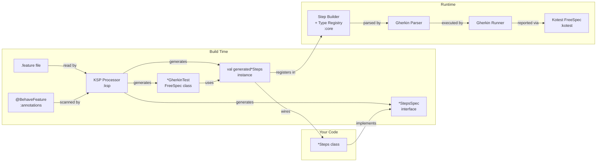
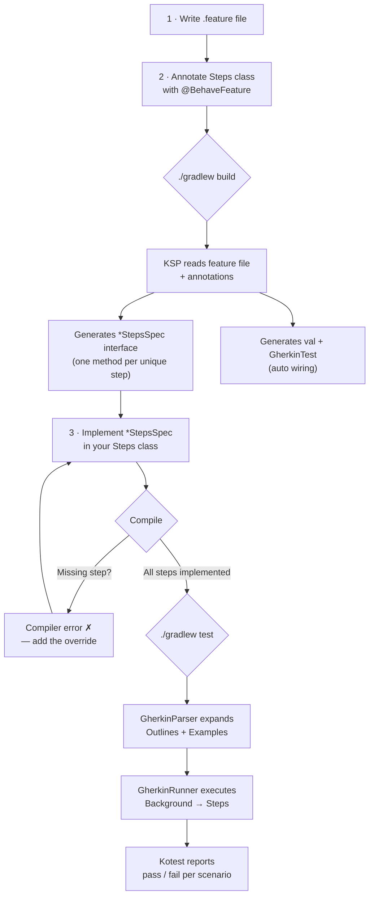
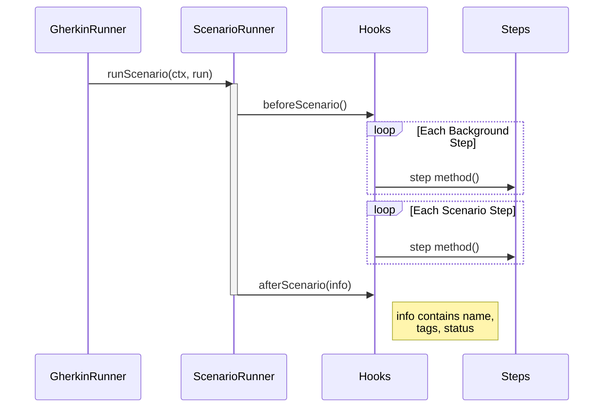

# kotlin-behave

BDD testing framework for Kotlin Multiplatform. Write Gherkin feature files, get
type-safe step definitions generated at compile time.

```gherkin
Feature: Todo list

  Scenario: Add a todo item
    When I add a todo "Buy groceries"
    Then the todo "Buy groceries" is displayed
```

```kotlin
@BehaveFeature("features/todo.feature")
class TodoSteps : TodoStepsSpec {
    override suspend fun whenIAddATodo(string: String) { /* ... */ }
    override suspend fun thenTheTodoIsDisplayed(string: String) { /* ... */ }
}
```

## Modules

| Module | Purpose | Targets |
|--------|---------|---------|
| `:core` | Runtime: step builder, Gherkin parser, runner, type registry | JVM, JS, iOS, macOS, Linux |
| `:kotest` | Kotest FreeSpec integration | JVM, JS, iOS, macOS, Linux |
| `:annotations` | `@BehaveFeature`, `@BehaveType`, `@BehaveCast` (compile-only) | JVM, JS, iOS, macOS, Linux |
| `:ksp` | KSP processor — generates `*StepsSpec` interfaces at build time | JVM |

## How It Works

### Full Setup Flow



### Test Writing Flow



### Scenario Lifecycle



## Setup

Three usage variants depending on how much compile-time safety you want:

### Variant 1: Core only — manual step registration

Use `:core` alone when you want to define steps manually without KSP code generation.

```kotlin
// build.gradle.kts
dependencies {
    testImplementation("io.mcol.kotlin-behave:core:0.1.0")
}
```

```kotlin
class CounterCtx { var count = 0 }

val counterSteps = steps(::CounterCtx) {
    Given("the counter is {int}") { (n: Int) -> ctx.count = n }
    When("I increment it") { ctx.count++ }
    Then("the counter is {int}") { (n: Int) ->
        assertEquals(n, ctx.count)
    }
}
```

Run with the built-in runner:

```kotlin
suspend fun main() {
    gherkin("features/counter.feature", counterSteps)
}
```

See [Core documentation](docs/core.md) for the full API.

### Variant 2: Core + Kotest — FreeSpec integration

Add `:kotest` for Kotest FreeSpec test tree generation.

```kotlin
// build.gradle.kts
dependencies {
    testImplementation("io.mcol.kotlin-behave:core:0.1.0")
    testImplementation("io.mcol.kotlin-behave:kotest:0.1.0")
    testImplementation("io.kotest:kotest-runner-junit5:5.9.1") // JVM
}

tasks.withType<Test> { useJUnitPlatform() }
```

```kotlin
class CounterGherkinTest : FreeSpec({
    gherkin("features/counter.feature", counterSteps)
})
```

IDE test tree:
```
CounterGherkinTest
  Feature: Counter
    Scenario: increment once         ✓
    Scenario: increment twice        ✓
```

See [Kotest documentation](docs/kotest.md) for per-scenario setup, tag filtering, and step-level reporting.

### Variant 3: Core + Kotest + KSP — full compile-time safety

Add `:annotations` + `:ksp` for KSP-generated step definition interfaces. The compiler tells
you if a step is missing — no runtime surprises.

```kotlin
// build.gradle.kts
plugins {
    id("com.google.devtools.ksp") version "2.1.20-1.0.32"
}

dependencies {
    testImplementation("io.mcol.kotlin-behave:core:0.1.0")
    testImplementation("io.mcol.kotlin-behave:kotest:0.1.0")
    testImplementation("io.kotest:kotest-runner-junit5:5.9.1")
    compileOnly("io.mcol.kotlin-behave:annotations:0.1.0")
    kspTest("io.mcol.kotlin-behave:ksp:0.1.0")
}

ksp {
    arg("behave.featureDir", "src/test/resources")
    arg("behave.projectDir", projectDir.absolutePath)
}

tasks.withType<Test> { useJUnitPlatform() }
```

**1. Write the feature file:**

```gherkin
# src/test/resources/features/todo.feature
Feature: Todo list

  Background:
    Given the todo list is empty

  Scenario: Add a todo
    When I add a todo "Buy groceries"
    Then the todo "Buy groceries" is displayed
```

**2. Annotate your class — KSP generates everything else:**

```kotlin
@BehaveFeature("features/todo.feature")
class TodoSteps : TodoStepsSpec {
    private val todos = mutableListOf<String>()

    override suspend fun givenTheTodoListIsEmpty() { todos.clear() }
    override suspend fun whenIAddATodo(string: String) { todos.add(string) }
    override suspend fun thenTheTodoIsDisplayed(string: String) {
        check(string in todos)
    }
}
```

**That's it.** KSP generates:
- `TodoStepsSpec` — interface with one method per unique step
- `val generatedTodoSteps` — step definitions instance wired to your class
- `class TodoGherkinTest` — Kotest FreeSpec test class

**3. Run tests:**

```bash
./gradlew test
```

No manual `val` or test class needed. Add lifecycle hooks, scenario runners, or
both — all via interfaces on the Steps class:

```kotlin
// Hooks: implement BeforeScenario, AfterScenario, or ScenarioHooks (both)
@BehaveFeature("features/todo.feature")
class TodoSteps : TodoStepsSpec, ScenarioHooks {
    override suspend fun beforeScenario() { db.clear() }
    override suspend fun afterScenario(info: ScenarioInfo) { log(info.status) }
    // ... step overrides
}

// Compose UI test: ScenarioRunner wraps each scenario in a test harness
@BehaveFeature("features/collections.feature")
class CollectionsSteps : CollectionsStepsSpec, HasAppRobot,
    ScenarioRunner by ComposeScenarioRunner() {
    override lateinit var app: AppRobot
    // ... step overrides only
}
```

Set `generateTest = false` only when you need fully manual wiring (custom types,
tag filtering):

```kotlin
@BehaveFeature("features/todo.feature", generateTest = false)
class TodoSteps : TodoStepsSpec { /* ... */ }
```

See [KSP documentation](docs/ksp.md) for all annotation options, type mappings, and
DataTable handling.

## Sharing Steps Across Features

When the same Gherkin step text appears in two or more `.feature` files, kotlin-behave
**errors at KSP time** unless you opt in via one of two mechanisms. Silent duplication is
never allowed — you must make a deliberate choice.

### `@StepsMixin` — write the body once, inherit everywhere

Declare an interface with `@StepsMixin` and a default body. Any generated `*StepsSpec`
whose step signature matches a mixin method auto-extends the mixin, so implementing
classes don't redeclare those methods.

```kotlin
@StepsMixin
interface SessionMixin {
    val session: AppSession                                       // abstract — class provides it

    suspend fun theAppIsStarted()             = run { session.started = true }
    suspend fun iLogInAs(string: String)      = run { session.currentUser = string }
}

@BehaveFeature("features/settings.feature")
class SettingsSteps : SettingsStepsSpec {                         // auto-extends SessionMixin
    override val session = AppSession()
    // theAppIsStarted() and iLogInAs() are inherited from the mixin — no redeclaration
}
```

Multiple mixins can share the same abstract `val` — a single override satisfies them all.
A class can still override a mixin default locally for feature-specific behavior. Two
mixins declaring the same `(methodName, paramTypes)` produces a build-failing error
naming both interfaces.

### `@DivergentStep` — different bodies per feature

When the same step text needs intentionally different bodies (e.g., web seeds a session
cookie, mobile calls a debug auto-login), mark **every** diverging override:

```kotlin
class WebSearchSteps : WebSearchStepsSpec {
    @DivergentStep
    override suspend fun theUserIsLoggedIn() { /* seed cookie */ }
}

class MobileSearchSteps : MobileSearchStepsSpec {
    @DivergentStep
    override suspend fun theUserIsLoggedIn() { /* debug menu */ }
}
```

Forget to annotate even one of them and the processor errors with the list of every
class that declares the step plus the two suggested fixes.

See [example 18](examples/src/test/kotlin/io/mcol/behave/examples/ex18_shared_mixin/) for
mixin composition and [example 19](examples/src/test/kotlin/io/mcol/behave/examples/ex19_divergent_steps/)
for divergent steps.

## Documentation

| Document | Content |
|----------|---------|
| [Core API](docs/core.md) | Step builder DSL, type registry, hooks, custom parameter types, tag filtering |
| [Kotest Integration](docs/kotest.md) | FreeSpec wiring, per-scenario setup, step-level reporting, tag filtering |
| [KSP Code Generation](docs/ksp.md) | `@BehaveFeature`, `@BehaveType`, `@BehaveCast`, `@StepsMixin`, `@DivergentStep`, generated interface format |
| [Examples](examples/README.md) | 19 runnable examples covering every feature |

## Examples

The [`examples/`](examples/) module contains 19 runnable examples:

```bash
./gradlew :examples:test
```

| # | Example | What it demonstrates |
|---|---------|----------------------|
| 1 | Basic steps | Given/When/Then/And/But, Background |
| 2 | String parameters | Quoted `"literal"` auto-detection |
| 3 | Number parameters | Auto-detected `Int` and `Double` |
| 4 | All parameter types | `{string}`, `{int}`, `{double}`, `{word}` |
| 5 | Scenario Outline | `<variable>` tokens, Examples table |
| 6 | Data Tables | Auto-generated Row class |
| 7 | @BehaveType placeholder | Custom `{token}` → domain type |
| 8 | Multi-column outline | 4-column Examples, multiple outlines |
| 9 | DataTable full mapping | `@BehaveType` covering all columns |
| 10 | DataTable + @BehaveType | Composite types in table rows |
| 11 | @BehaveCast | Lossy conversion (Int ← decimal) |
| 12 | Tags | `@tag` filtering, boolean expressions |
| 13 | Hooks | Before/After with ScenarioInfo |
| 14 | Name collisions | Numeric suffix resolution |
| 15 | Full integration | Everything combined |
| 16 | Recipes with shared steps | `@StepsMixin` consumed across two features (recipes side) |
| 17 | Checkout with shared steps | Same mixin consumed from a second feature (checkout side) |
| 18 | Multi-mixin composition | Two `@StepsMixin` interfaces sharing one `val session` |
| 19 | Divergent steps | `@DivergentStep` for intentionally different bodies per feature |

## Claude Code BDD Skill

kotlin-behave ships a [Claude Code](https://claude.ai/code) plugin with a **BDD skill**
that guides AI agents through the correct BDD workflow: feature file first, then steps,
then interfaces, then implementation.

### Install the plugin

```bash
claude --add-dir /path/to/kotlin-behave
```

### Use the skill

Once installed, invoke the skill in Claude Code:

```
/kotlin-behave:bdd
```

The skill enforces:
- **Feature file before code** — no production code without a Gherkin scenario
- **Test integrity** — never modify tests to hide bugs; tag `@wip` for out-of-scope failures
- **kotlin-behave + KSP workflow** — feature → generated spec → implementation → verify

See [`skills/bdd/SKILL.md`](skills/bdd/SKILL.md) for the full skill content.

## License

`kotlin-behave` is licensed under the [Apache License 2.0](LICENSE).

For attribution to upstream projects see [NOTICE](NOTICE), and for the full
inventory of third-party dependencies and their licenses see the
[generated HTML report](docs/licenses/third-party-licenses.html). To regenerate it:

```
./gradlew checkLicense
```
