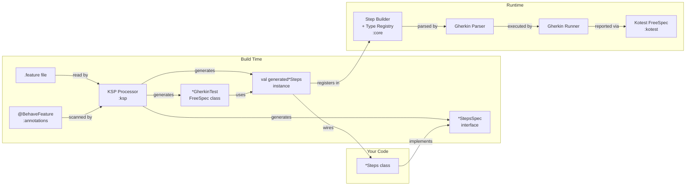
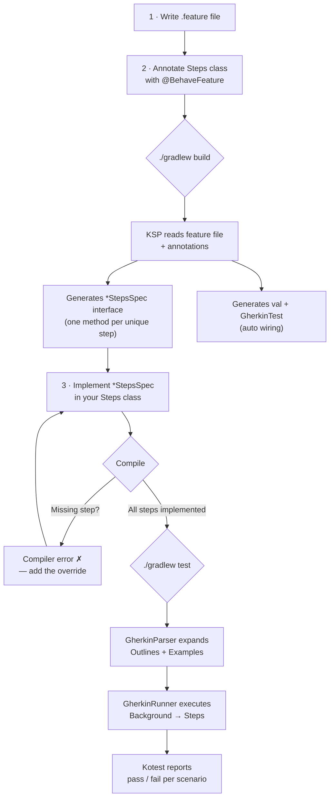
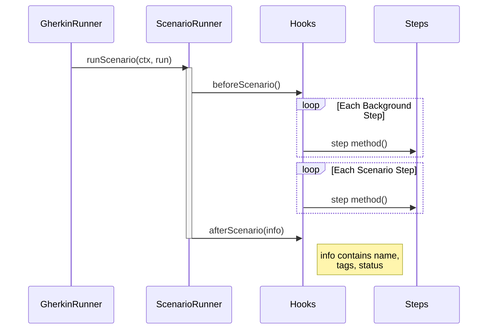

# Architecture & Diagrams

[← Back to README](../README.md)

How the pieces fit together — build-time generation, the test-writing loop, and the
per-scenario lifecycle.

## Modules

| Module | Purpose | Targets |
|--------|---------|---------|
| `:core` | Runtime: step builder, Gherkin parser, runner, type registry | JVM, JS, iOS, macOS, Linux |
| `:kotest` | Kotest FreeSpec integration | JVM, JS, iOS, macOS, Linux |
| `:annotations` | `@BehaveFeature`, `@Type`, `@TypeConverter`, `@BehaveType`, `@BehaveCast`, `@StepsMixin`, `@DivergentStep` (compile-only) | JVM, JS, iOS, macOS, Linux |
| `:ksp` | KSP processor — generates `*StepsSpec` interfaces at build time | JVM |

## Full setup flow

## Test-writing flow

## Scenario lifecycle

