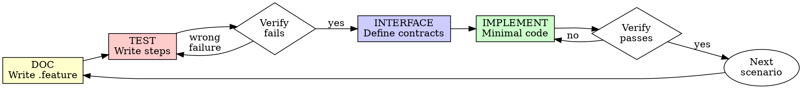

# Behavior-Driven Development with kotlin-behave

## Overview

Write the feature file first. Write step definitions. Then implement.

**Core principle:** If you didn't write the Gherkin scenario before the code, you don't know
if the code solves the right problem.

**Violating the letter of the rules is violating the spirit of the rules.**

## The Iron Law

```
NO PRODUCTION CODE WITHOUT A GHERKIN SCENARIO FIRST
```

Write code before the scenario? Delete it. Start over.

**No exceptions:**
- Don't keep it as "reference"
- Don't "adapt" it while writing steps
- Delete means delete

## The BDD Cycle

```
Feature file (.feature)      ← WHAT should happen (stakeholder language)
    ↓
Step definitions (*Steps.kt) ← HOW to verify it
    ↓
Interfaces                   ← CONTRACT the code must fulfill
    ↓
Implementation               ← Minimal code to pass
```

**Order is sacred.** Each layer must exist before the next.



### 1. DOC — Write the Feature File

Write Gherkin scenarios describing the behavior in stakeholder language.

```gherkin
Feature: Todo list

  Background:
    Given the todo list is empty

  Scenario: Add a todo item
    When I add a todo "Buy groceries"
    Then the todo "Buy groceries" is displayed
    And 1 todo is displayed

  Scenario Outline: Priority levels
    When I add a todo "Task" with priority "<priority>"
    Then the last todo shows "<priority>" priority

    Examples:
      | priority |
      | high     |
      | medium   |
      | low      |

  Scenario: Batch import todos
    When I import the following todos:
      | title        | priority |
      | Clean house  | high     |
      | Read book    | low      |
    Then 2 todos are displayed
```

**Rules:**
- Feature files live in `src/test/resources/features/` (or `src/commonTest/resources/features/` for KMP)
- Use concrete examples, not abstract descriptions
- One scenario per behavior — if you write "and" between behaviors, split
- Background for shared setup only

### 2. TEST — Write Step Definitions

Annotate your class with `@BehaveFeature`, implement the KSP-generated `*StepsSpec` interface:

```kotlin
@BehaveFeature("features/todo.feature")
class TodoSteps : TodoStepsSpec {

    private val todos = mutableListOf<Todo>()

    override suspend fun givenTheTodoListIsEmpty() {
        todos.clear()
    }

    override suspend fun whenIAddATodo(string: String) {
        todos.add(Todo(title = string))
    }

    override suspend fun thenTheTodoIsDisplayed(string: String) {
        check(todos.any { it.title == string })
    }

    override suspend fun andTodoIsDisplayed(int: Int) {
        assertEquals(int, todos.size)
    }

    // ... remaining steps
}

val generatedTodoSteps = TodoStepsSpec.steps { TodoSteps() }
```

### 3. VERIFY RED — Watch It Fail

```bash
./gradlew test
```

Confirm:
- Test fails (not errors)
- Fails because feature is missing, not because of typos
- Step definition compiles against generated `*StepsSpec` interface

### 4. INTERFACE — Define Contracts

Write the interface the production code must fulfill:

```kotlin
interface TodoRepository {
    suspend fun add(todo: Todo)
    fun getAll(): Flow<List<Todo>>
}
```

**Write interfaces before implementation.** The test and the interface define the contract.

### 5. IMPLEMENT — Minimal Code to Pass

Write the simplest code that makes the scenario pass. Don't add features, don't refactor
other code, don't "improve" beyond the scenario.

### 6. VERIFY GREEN — Watch It Pass

```bash
./gradlew test
```

All scenarios pass. Move to next scenario.

## kotlin-behave + KSP Pattern

```
features/foo.feature          ← you write
    ↓ KSP generates
FooStepsSpec.kt               ← generated interface (don't edit)
    ↓ you implement
FooSteps.kt                   ← @BehaveFeature class
    ↓ registered as
val generatedFooSteps = FooStepsSpec.steps { FooSteps() }
    ↓ used in
FooGherkinTest.kt             ← kotest FreeSpec
```

### GherkinTest Wiring

```kotlin
class TodoGherkinTest : FreeSpec({
    gherkin("features/todo.feature", generatedTodoSteps)
})
```

For per-scenario setup (e.g. database, UI test harness):

```kotlin
class TodoGherkinTest : FreeSpec({
    gherkin("features/todo.feature", generatedTodoSteps) { ctx, run ->
        // per-scenario setup
        (ctx as TodoSteps).db = createTestDatabase()
        run()
    }
})
```

## Test Types and When to Use Each

| Test Type | Framework | When to Use |
|-----------|-----------|-------------|
| **UI / E2E** | kotlin-behave + kotest + KSP | User-facing flows, screen interactions |
| **Integration** | kotlin-behave + kotest + KSP | UseCase + Repository + DB, multi-layer |
| **Unit (BDD)** | kotlin-behave + kotest + KSP | Complex business logic with scenarios |
| **Unit (classic)** | JUnit / kotest | Simple functions, pure logic, data transforms |

**Default to BDD** (kotlin-behave + KSP) for anything with behavior worth describing in
plain language. Use JUnit only for pure functions where Gherkin adds no clarity.

## Tests That Reveal Bugs Are Sacred

A failing test that exposes a real bug or missing behavior is **not a problem to fix in the test**.

### The Rule

```
NEVER modify, delete, or weaken a test to make it pass when the test reveals a genuine issue.
```

### What to do when a test fails and it's right

| Situation | Action |
|-----------|--------|
| Test reveals a bug in production code | **Fix the production code**, not the test |
| Test reveals a bug in a library/dependency | **Fix the library**, not the test |
| Test reveals missing behavior outside current scope | **Tag with `@wip`** and add a TODO comment (see below) |
| Test assertion is genuinely wrong (typo, wrong expected value) | Fix the assertion — this is a test bug, not weakening |

### Out-of-scope failures: tag and skip, don't delete

When a test exposes a real issue that is **outside the current task's scope**, do NOT delete
or rewrite the scenario. Instead:

**Gherkin (kotlin-behave):** Add `@wip` tag to skip at runtime, and a comment explaining why:

```gherkin
# TODO: fix converter ordering when {string} precedes {int} — see issue #42
@wip
Scenario: Collection with string before int
    Then the collection "Animals" has 2 words
```

The test runner supports skipping `@wip`:
```kotlin
gherkin("features/foo.feature", steps, tags = "not @wip")
```

**JUnit / Kotest:** Comment out with a `TODO` explaining the issue:

```kotlin
// TODO: fix converter ordering — see issue #42
// @Test
// fun `collection with string before int`() { ... }
```

### Prohibited actions

- Changing a step's expected value to match buggy output
- Rewording a scenario to avoid triggering a bug
- Removing a scenario because it fails
- Replacing a precise assertion with a weaker one
- Swapping placeholder order in feature text to work around a runtime bug

### The test worked — you broke something?

If a previously passing test starts failing after your changes:

1. **Your change introduced a regression** → fix your code
2. **The test was fragile and your change exposed it** → fix the test's fragility, not its intent
3. **The test's assumptions were always wrong** → discuss with the user before changing

## Common Rationalizations

| Excuse | Reality |
|--------|---------|
| "Feature file is overkill for this" | If it has behavior, describe it. Feature file takes 30 seconds. |
| "I'll write the feature file after" | After = biased by implementation. You test what you built. |
| "Steps are just boilerplate" | Steps force you to think about API from consumer perspective. |
| "This is just a unit test" | If it has scenarios, use BDD. JUnit only for pure functions. |
| "Interface first slows me down" | Interface-first catches design problems before you write code. |
| "The test is wrong, let me fix it" | If it reveals a real bug, the test is right. Fix the code. |
| "I'll reword the scenario to avoid the bug" | That's hiding a bug, not fixing it. Tag `@wip` if out of scope. |
| "This failing test is out of scope" | Tag it `@wip` with a TODO comment. Never delete it. |

## Red Flags — STOP and Start Over

- Code before feature file
- Implementation before interface
- Feature file written after implementation
- Rationalizing "just this once"
- **Modifying a test scenario to avoid a bug instead of fixing the bug**
- **Deleting a failing scenario because it's "out of scope"**

**All of these mean: Delete code. Start over with BDD.**

## Verification Checklist

Before marking work complete:

- [ ] Feature file exists and describes all behaviors
- [ ] Step definitions implement generated `*StepsSpec` interface
- [ ] Interfaces defined before implementation
- [ ] All scenarios pass (or out-of-scope ones tagged `@wip` with TODO)
- [ ] GherkinTest uses `generatedXxxSteps` pattern

## Final Rule

```
Feature file → Steps → Interfaces → Implementation
Otherwise → not BDD
```

No exceptions without your human partner's permission.
